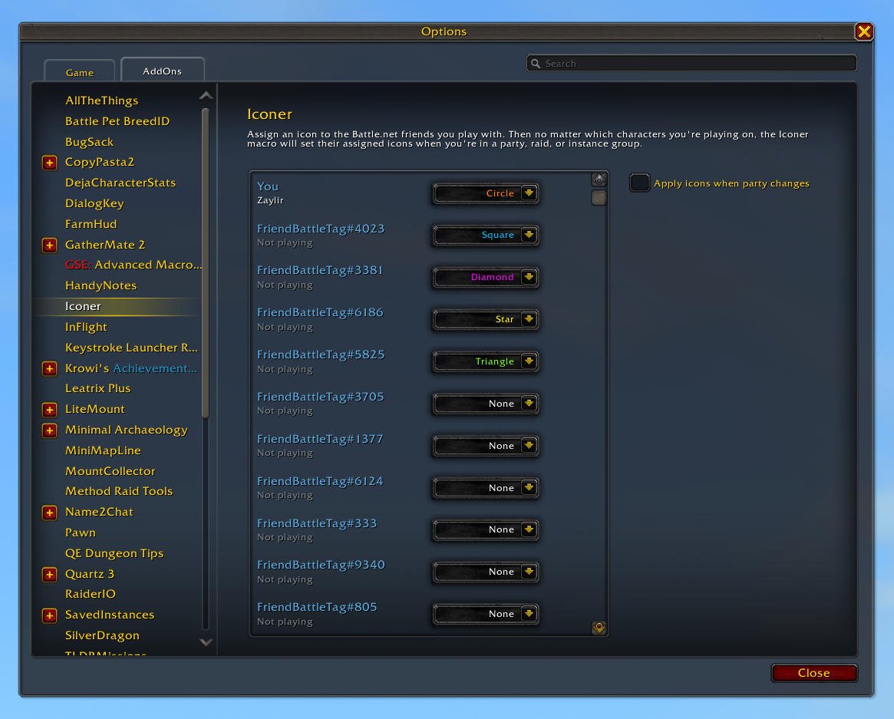

# Iconer Add-On 

When playing World of Warcraft with friends, it can be handy to assign icons to each player to keep track of where people are when exploring or in battle. If you play with the same people but on different characters, assigning those icons can be a little tedious. With Iconer, you can configure any of the eight raid icons to the BattleTag of your friends. Then when you're in a party, raid, or instance group with any of your friends, you can run the `/iconer` command to set the icons.

## Usage
1. Install the Iconer add-on using Twitch, Wowup, or any other add-on manager.
2. Configure your friends' icons. Open the Game Menu, tap Interface, then the AddOns tab, then Iconer (or run `/iconer options`). For your friends—and yourself—select an icon from the dropdown next to their BattleTag.
3. Assign the configured icons to all the friends in your party, raid, or instance group by running `/iconer`. Better yet, create a Macro containing the `/iconer` command and drop it on an action bar.

## Author
Created by Peter Wooley. You can find me in game on Kirostis playing for the Horde on Cenarius or Zaylir playing for the Alliance on Silver Hand.
